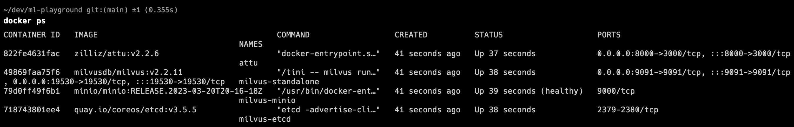
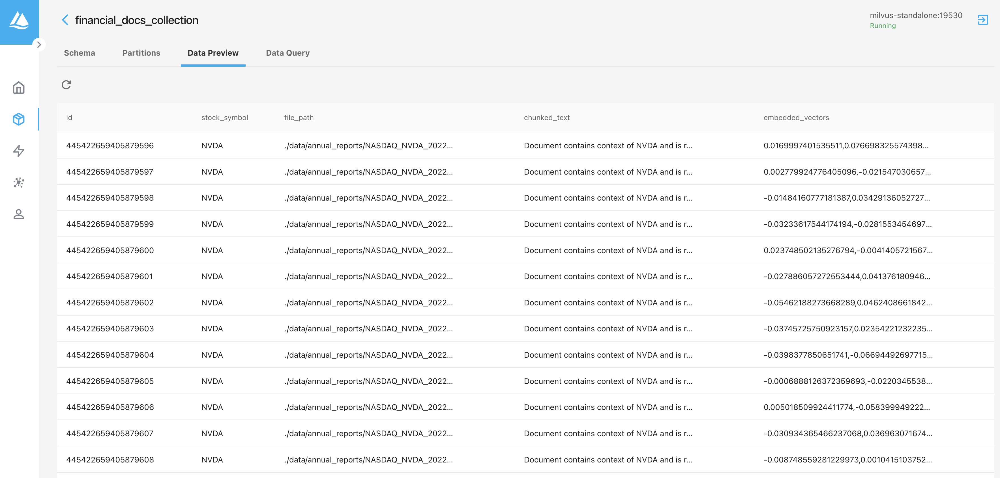
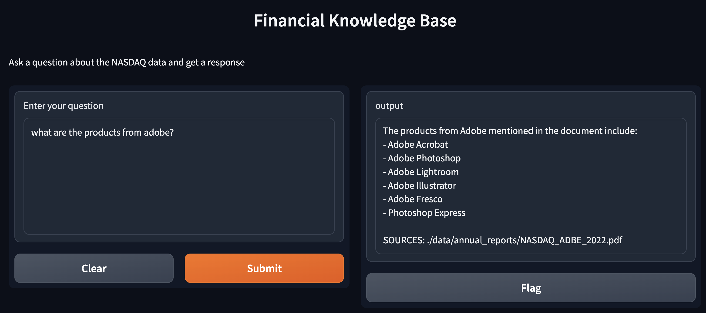

# Ingest and embed at scale using Spark for Retrieval Augment Generation

## Setup instructions for Linux or MacOS

> **_NOTE:_** For Windows, you may have to make some edits for it to work. I don't have a windows machine and hence not tested on it. If you make modifications, please share the instructions and I will update it in the readme.

### Install the required infastructure components using docker

```bash
docker-compose -f rag-spark/docker-compose.yml up -d
```

> **_NOTE:_** If you get an error running the docker-compose and complains about permissions, try re-running the above command once more or give the folder explicit permission using chmod

Confirm if all the containers are running properly by running:

```bash
docker ps
```

You should see the following containers:



Let's setup the python environment. This needs python 3.10 and above

```bash
python3 -m venv myenv
source myenv/bin/activate
pip install --upgrade pip
pip install -r rag-spark/requirements.txt
```

> **_NOTE:_**  Before running any of the commands, please rename setup.env to .env and provide the required API token i.e. openai and/or replicate.

### Setup the collection in Milvus

```bash
python rag-spark/setup_milvus.py
```

### Ingest the PDF using spark (local mode)

We will be ingesting a few annual reports kept in ./rag-spark/data/annual_reports. Before we run the ingestion routine, we need to provide path to java home directory. Spark 3.2 supports Java 8/11, while newer sparks > 3.4 support Java 8/11/17. The code below is tested using Java 8, so the path to JAVA_HOME is set to Java 8. You can try with Java 11 or 17 but in case of an issue, please switch back to Java 8.

```bash
export JAVA_HOME=<path to java home>
python rag-spark/pdf_ingestion.py
```

If all goes well, the data will be in Milvus. You can check out the collection by pointing your browser to <http://localhost:8000>



### Query the vector DB and answer using OpenAI

```bash
python rag-spark/qa_service_openai.py
```

A gradio based interface is shown. Point your browser to <http://127.0.0.1:7860> and try a few queries based on the financial statements



### Query the vector DB and answer using Llama2

This uses a LLM hosting service called replicate. This assumes you have signed in to replicate and have a required API token

```bash
python rag-spark/qa_service_llama2.py
```

> **_NOTE:_**  Before running this, please rename setup.env to .env and provide the replicate key.

A similar gradio interface is shown. The instructions to query above works for this scenarios also.